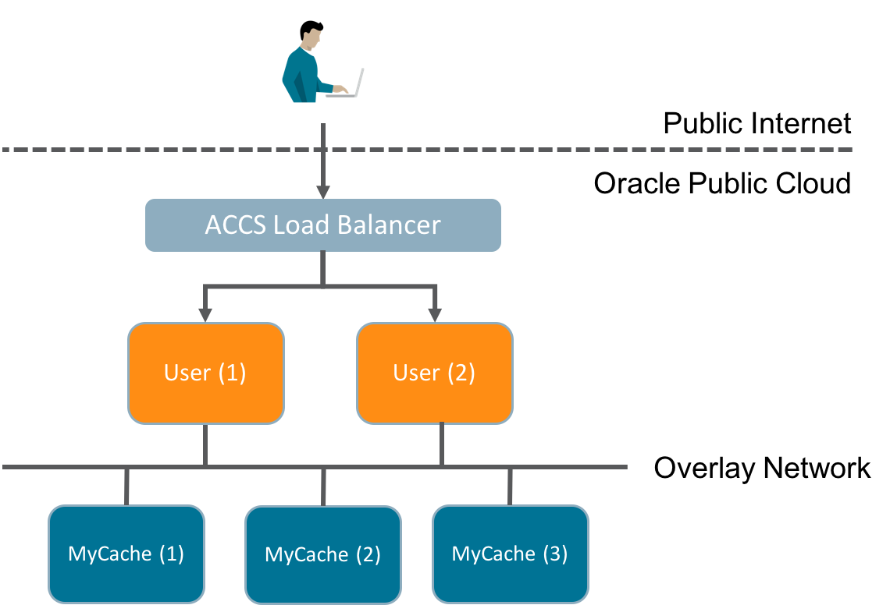
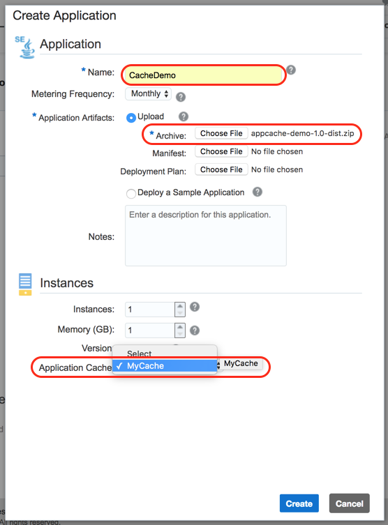
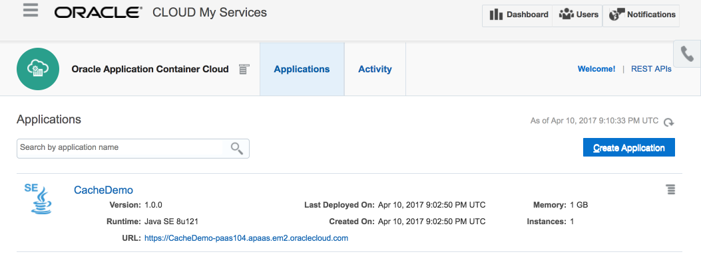

Oracle Application Container Cloud: Introducing the Application Cache Java Client Library
=========================================================================================

The [Oracle Application Container Cloud (ACCS)](http://cloud.oracle.com/acc)'s Application Cache provides (as the name implies) caching for applications!  You simply specify the amount of memory you want to cache and whether you just need basic non-HA cache for dev/test or reliable caching for production and the appropriate infrastructure is automatically provisioned.  

Under the Hood
--------------
The ACCS Application Cache is built on the highly performant and scalable [Oracle Coherence](http://www.oracle.com/technetwork/middleware/coherence/overview/index.html) in-memory data grid that's been powering trading and other memory and time sensitive applications for years.  In the ACCS Application Cache, the underlying Coherence implementation is not exposed but if you need an in-memory data grid cloud service don't worry, Oracle is working on exactly that.  In the meantime, the Coherence team continues to innovate.  For example here's the Coherence team's [Brian Oliver speaking at Oracle Code in on distributed streams](https://youtu.be/9yt43EIDJmg).

That's a little about the amazing engine that's under the hood, but let's get back to the main topic.

Java Caching
------------

The Application Cache was initially released with a language independent REST API, but to make it easier for Java applications to leverage caching a new native Java client library created.  In addition to simplifying cache usage from Java, the library also adds the option of [GRPC](http://www.grpc.io/) for efficient data transfer between caches and clients. The client library is an open source framework with sources hosted on [GitHub](https://github.com/oracle/accs-caching-java-sdk) and binaries both directly downloadable and available through Maven Central.

To introduce the Java client library I'll go over usage basics in the context of a simple example and then show how to deploy that example code to Application Container Cloud.

Background
----------

My assumption is that you're familiar with the features of the Application Cache and I'm just going to focus on the Java client library.  If you're not familiar with the ACCS Application Cache yet you can learn more with with the following resources:

* [Using Caches in Oracle Application Container Cloud Service](http://docs.oracle.com/en/cloud/paas/app-container-cloud/cache/index.html)
* Tutorial: [Create a Java application using the Caching REST API in Oracle Application Container Cloud Service](http://www.oracle.com/webfolder/technetwork/tutorials/obe/cloud/apaas/java/java-accs-caching-basic/java-accs-caching-basic.html)
* Tutorial: [Creating a Node.js Application Using the Caching REST API in Oracle Application Container Cloud Service](http://www.oracle.com/webfolder/technetwork/tutorials/obe/cloud/apaas/node/node-accs-caching-basic/node-accs-caching.html#overview)

Cache API Basics
----------------

To access a cache using the Java client library there are a few simple steps:

1. Create a `SessionProvider` for an Application Cache that you've previously created providing a URL with its name (e.g., `MyCache`) and the port that supports the desired transport protocol: 1444 for GRPC, 8080 for REST.  When using REST, the cache hostname is followed by "/ccs".

    `SessionProvider sessionProvider = new RemoteSessionProvider("http://MyCache:1444");`

2. Obtain a Session from the SessionProvider specifying the transport that is available on the selected port.

    `Session cacheSession = sessionProvider.createSession(Transport.grpc());`

3. Obtain a Cache object from the Session. If the cache doesn't exist it will be created.

    `Cache<Users> users = cacheSession.getCache("users");`

Using A Cache
-------------

Caches support operations to get, put, replace, and remove items (which are key/value pairs).  Each of these operations is included in the example which provides a very simple User management REST service using the [Java Spark](http://sparkjava.com/) framework.  At the backend of the example is the `UserService` that provides User create/update/delete operations which are implemented using the Application Cache Java client library.  For example, the code to put a User object into the `users` cache with its id as the key is:

`users.put(user.getId(),user);`

Removing an object from a cache can be as simple as calling `users.remove(id)` but because caches are not local the remove API provides performance optimization options.  The JDK `java.util.Map` interface defines the return value of the `remove()` method as the object that was removed (if it exists).  But when dealing with a cache you  may just want to remove the object and not pay the cost of transporting the removed object from the cache back to the client.  For this reason, the Java client library `Cache.remove()` method let's you specify, amongst other things, whether you want the removed object returned or not.  By default the removed object is not transfered across the wire and the method returns null.  In the example we do want the removed object so we use the `Return.OLD_VALUE` option.

`User user = users.remove(id, Return.OLD_VALUE);`

Updating a user is done using `Cache.replace()` which, like `remove()` provides options to allow you to control the amount of data being transferred over the network.  In this case, we're not interested in the details of the object being replaced so we'll go with the default behavior which does not transfer the previous object at the specified key and simply returns null.  

`users.replace(id, user);`

The following diagram illustrates the structure of this example when deployed to the Application Container Cloud.  Clients interact with the User application via REST which is routed through the ACCS load balancer.  In the diagram we've scaled the application out to two instances.  The 'MyCache' Application Cache is also scaled out to three instances to provide HA and ensure all data is memory safe.  The loss of any one cache instance will not result in data loss.  User applications are stateless and use the Java client library to interact with a cache over the internal ACCS overlay network.  As we scale the number of User application instances up and down to handle varying workloads the data remains safely stored in the cache.

Deploying the Example
---------------------

Enough background!  Let's get on with deploying the example and trying it out.

1. Create the "MyCache" Application Cache.

   Create an Application Cached called `MyCache` with just 1GB of storage and use the Basic strategy.  Basic with 1GB does not ensure memory safety of cached data but it's fine for an example.  Follow the "Creating a Cache" instructions in [Using Caches in Oracle Application Container Cloud Service](http://docs.oracle.com/en/cloud/paas/app-container-cloud/cache/creating-cache-service.html)

2. Clone this example's Git repository locally.

3. Build the example and generate a deployable application archive

   In the cache-client-examples/appcache-example folder of the cloned Git repository run `mvn clean package`.  This will generate a "fat" jar that contains both the example application code and all of the libraries the application depends on, including the Java client library.  The Maven build also generates an ACCS application archive file which packages the fat jar along with a manifest.json file.

4. Deploy the example to ACCS

 1. Navigate to the ACCS Service console, click "Create Application", and choose Java SE for the runtime.

 2. Provide an application name, choose "Upload", and select the application archive `appcache-example-1.0-dist.zip` from the Maven generated `target` folder.

 3. Select `MyCache` as the associated Application Cache.

     Be aware that if you haven't created the Application Cache or it's still being provisioned the cache selection drop down won't appear.  Another way to associate the Application Cache with the application is with a [service binding in a deployment.json](http://docs.oracle.com/en/cloud/paas/app-container-cloud/dvcjv/creating-meta-data-files.html) file.

 4. Click 'Create' to upload the application archive and deploy an instance of the example--that's it!

     If you prefer to work on the command line instead of using the web console, you can also use CURL with the [ACCS REST API](http://docs.oracle.com/en/cloud/paas/app-container-cloud/apcsr/index.html) to create and fully manage the lifecycle of an application.

Using the Example
-----------------

Once the application is running you can find its URL in both the Applications list and on the application details page.  We're going to need the URL to exercise the deployed application.

### Creating a User

To keep things simple I'll use CURL to interact with the deployed example.  To create a User we'll need to perform a POST.  The post endpoint in the `UserController` class looks like:

		post("/users", (req, res) -> userService.createUser(
				req.queryParams("name"),
				req.queryParams("email")
		), json());

From this we can see we'll need to pass two query parameters, `name` and `email`.  In a terminal window try the following, substituting your application URL in place of mine:

    $ curl -i -X POST https://CacheDemo-paas104.apaas.em2.oraclecloud.com/users?name=mark\&email=twain@riverboat.org

When I run this I get a 200 response with a JSON version of the created User object that has been placed into the cache:

	HTTP/1.1 200 OK
	Date: Wed, 19 Apr 2017 19:46:16 GMT
	Content-Type: application/json
	Transfer-Encoding: chunked
	Server: Jetty(9.3.6.v20151106)

	{"id":"74ca1448-73f3-41f5-bb11-fda54c9dff1f","name":"mark","email":"twain@riverboat.org"}scripts$

### Updating a User

Try the following (substituting the id of the User you just created) to update the created User's name and email (remember this is a *simple* example so it's not very sophisticated):

    $ curl -i -X POST https://CacheDemo-paas104.apaas.em2.oraclecloud.com/users/74ca1448-73f3-41f5-bb11-fda54c9dff1f?name=luke\&email=luke@rebellion.org

Output:

	HTTP/1.1 200 OK
	Date: Wed, 19 Apr 2017 19:47:23 GMT
	Content-Type: application/json
	Transfer-Encoding: chunked
	Server: Jetty(9.3.6.v20151106)

	{"id":"74ca1448-73f3-41f5-bb11-fda54c9dff1f","name":"luke","email":"luke@rebellion.org"}

### Deleting a User

Let's DELETE the user from the cache (which returns the deleted User object):

	$ curl -i -X DELETE http://CacheDemo-paas104.apaas.em2.oraclecloud.com/users/74ca1448-73f3-41f5-bb11-fda54c9dff1f

	HTTP/1.1 200 OK
	Date: Wed, 19 Apr 2017 19:48:13 GMT
	Content-Type: application/json
	Transfer-Encoding: chunked
	Server: Jetty(9.3.6.v20151106)

	{"id":"74ca1448-73f3-41f5-bb11-fda54c9dff1f","name":"luke","email":"luke@rebellion.org"}scripts$

And just to confirm the deletion let's GET the User:

	$ curl -i -X GET http://CacheDemo-paas104.apaas.em2.oraclecloud.com/users/74ca1448-73f3-41f5-bb11-fda54c9dff1f

Which results in a 404 error as it's no longer in the cache.

	HTTP/1.1 404 Not Found
	Date: Wed, 19 Apr 2017 19:48:23 GMT
	Content-Type: application/json
	Transfer-Encoding: chunked
	Server: Jetty(9.3.6.v20151106)

Developing Locally
------------------

To make it easier to develop, test, and debug applications that use Application Caches, the Java cache client library includes support for a `LocalSession`.  It offers the exact same API as the `RemoteSession` you would use when deploying to ACCS but it runs in-process.  Take a look at the example `LocalUserService` class which uses a `LocalSession`.  By running the `LocalMain` class you can start the example application with a local in-process cache rather than a remote shared cache.  Handy!

Obtaining the Application Cache Java Client Library
---------------------------------------------------

There are a few ways to obtain the Java cache client library depending on how you prefer to work.  

1. The first is through Maven Central.  The dependency you would add to your Maven pom.xml is:

		<dependency>
			<groupId>com.oracle.cloud.caching</groupId>
			<artifactId>cache-client-api</artifactId>
			<version>1.0.0</version>
		</dependency>

2. The second way is from the Oracle Technology Network.  Here you can download a zip with the jars, javadoc, and sources.

3. And finally you can always get the [sources from GitHub](https://github.com/oracle/accs-caching-java-sdk) where the client library is housed.

Acknowledgements
================

This example is based on code from a blog post by Michael Scharhag introducing the Java Spark framework.  The original code has an [Apache 2.0 license](https://github.com/mscharhag/blog-examples/blob/master/LICENSE) and I've made substantial changes as is permitted. In particular I've replaced the in-memory User HashMap in the original with an ACCS Application Cache.  You can find the original posting and associated code on [Michael's blog](http://www.mscharhag.com/java/building-rest-api-with-spark).
